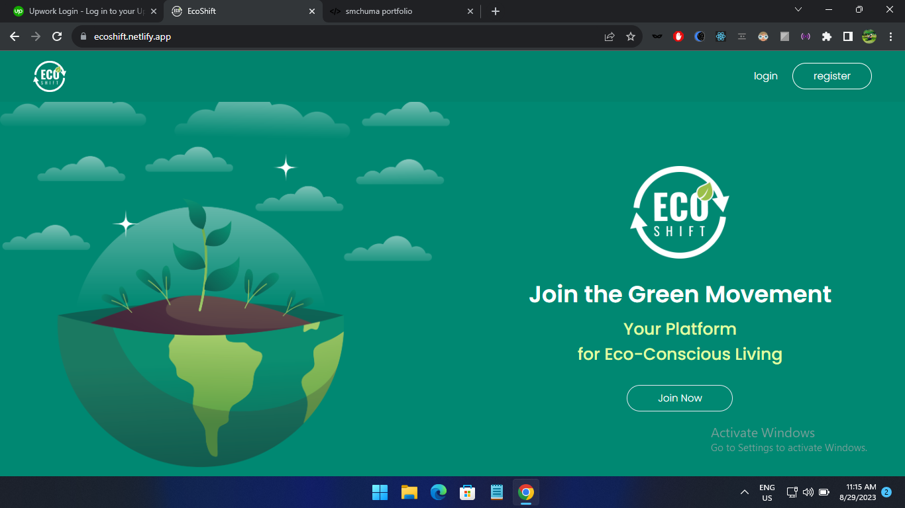
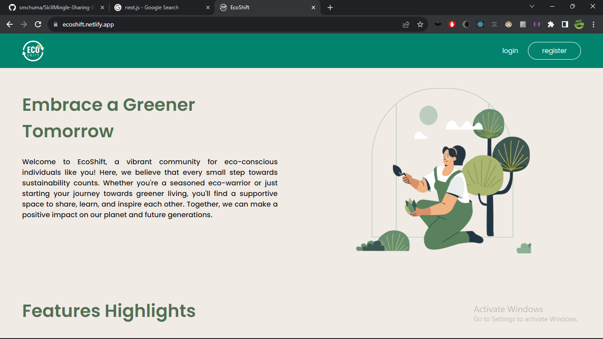
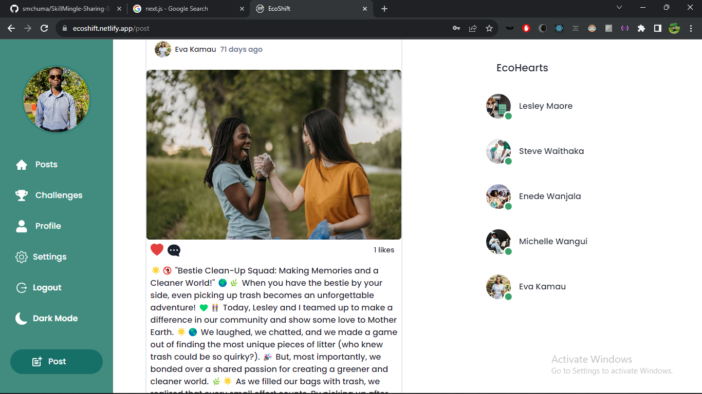
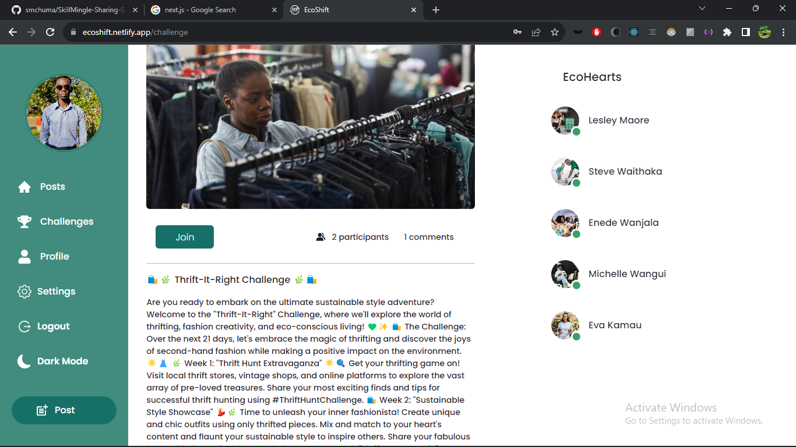
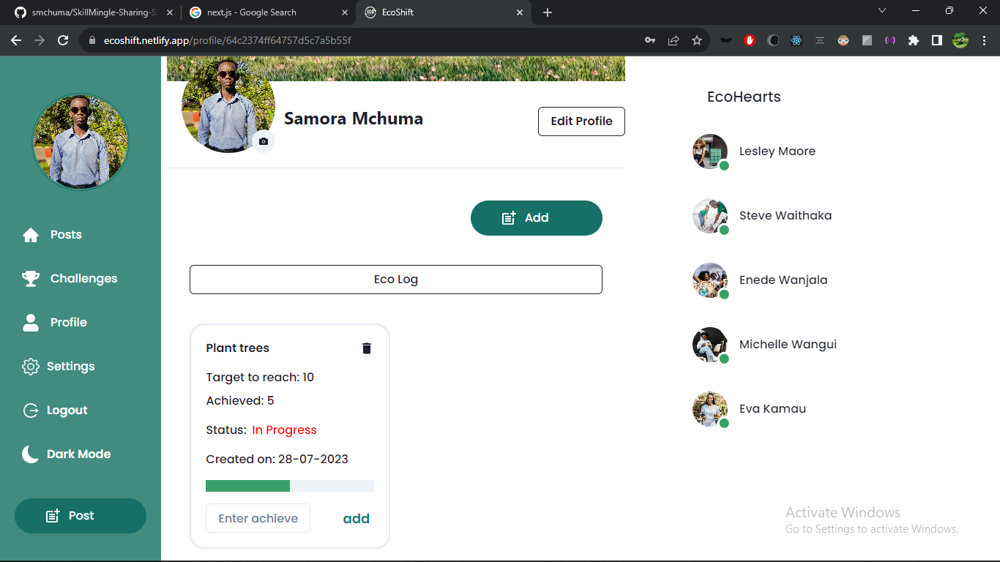
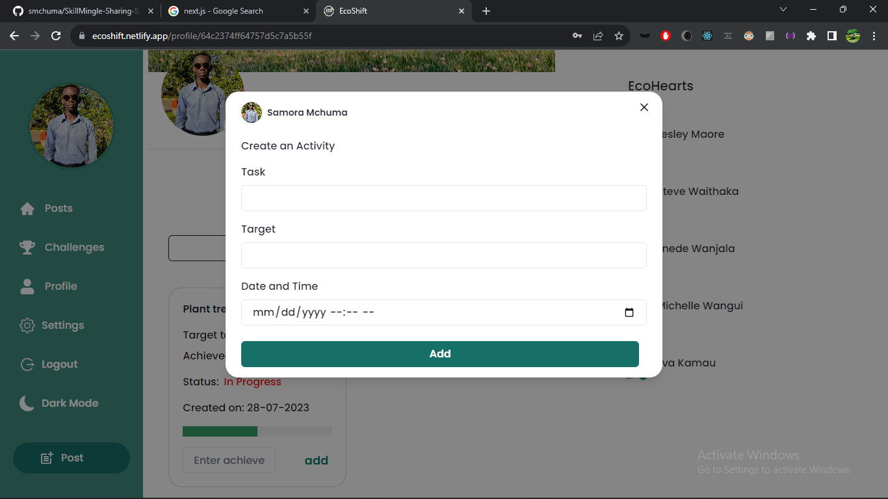
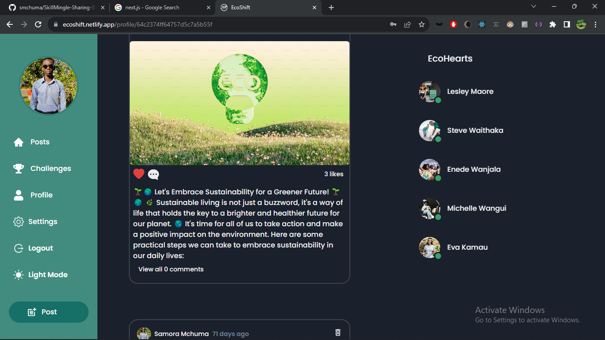

# EcoShift: Empowering Eco-Conscious Living

Welcome to EcoShift, your go-to platform for embracing sustainable living and connecting with a vibrant community of eco-conscious individuals. Whether you're an experienced eco-enthusiast or just starting your green journey, EcoShift provides the perfect space to learn, share, and inspire. Let's join hands to make a positive impact on our planet and future generations.

## Features

### Share Your Wisdom: Post Blogs and Videos 🌱

Contribute to our knowledge hub by sharing your eco-friendly practices, DIY recycling tips, and sustainable living ideas. Inspire others and gain recognition for your efforts. Your voice matters!

### Discover Green Gems: Explore Eco-Conscious Content 💚

Dive into a treasure trove of informative articles, how-to guides, and eye-opening videos created by our passionate community. Learn new ways to reduce your carbon footprint and adopt eco-conscious habits. Knowledge is power!

### Join Green Challenges: Embrace Sustainable Challenges 🌍

Participate in fun and impactful challenges that encourage greener living. From 'Waste-Free Wednesdays' to 'Eco-Friendly Gardening,' every challenge you take on earns you points and recognition. Small actions, big impact!

### Connect and Collaborate: Find Like-Minded Souls 🌿

Connect with like-minded eco-warriors, join groups, and collaborate on eco-projects. Together, we can amplify our impact and create a greener world. Join us in building a community that cares!

## Technologies Used 🚀

- **Frontend:** Built with React.js and Chakra UI for a seamless user experience.
- **Backend:** Powered by Node.js for robust server-side functionality.
- **Database:** MongoDB ensures efficient data storage and retrieval.

## Screenshots

_Embrace a Greener Tomorrow._

_Post Page_

_Challenge Page_

_Profile Page_

_Eco log_

_Dark mode_

## Getting Started 🌱

To get started with EcoShift:
link: https://ecoshift.netlify.app/
